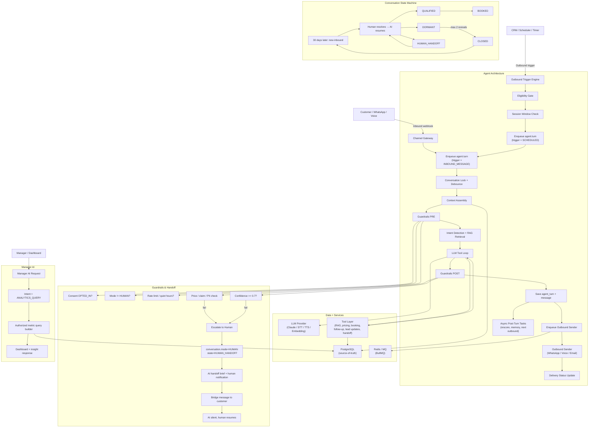

# Complete Flowchart — NotifyTechAI Two-Way Agent

This file captures the complete end-to-end flow for the NotifyTechAI two-way AI sales agent architecture shown in the existing diagram.

## Key sections included

- Inbound workflow: webhook → enqueue → conversation lock → debounce → context assembly → guardrails → intent + RAG → LLM tool loop → output save → outbound sender → delivery update.
- Outbound workflow: scheduled / CRM-triggered jobs pass eligibility rules, session window checks, then use the same agent runtime and tools as inbound.
- Agent architecture: channel gateway + Redis/MQ + PostgreSQL + agent runtime + tool layer + LLM provider + outbound sender.
- Conversation states: NEW, ENGAGING, QUALIFIED, BOOKED, DORMANT, HUMAN_HANDOFF, CLOSED.
- Guardrails: pre-LLM consent/mode/rate-limit checks, post-LLM safety checks for price, PII, claim, confidence, and escalation to human.
- Handoff: AI prepares brief, sets mode=HUMAN, sends one bridge message, remains silent until human resolves.
- Manager AI: RBAC + typed analytics query builder, read replica access, narrative response.

## Notes

- The diagram reflects the existing two-way AI agent design and extends it into a unified flowchart for both reactive and proactive directions.
- It preserves the principle that the agent uses the same domain services as the CRM UI and never bypasses the authoritative database.
- It shows the critical 24-hour WhatsApp session window and the importance of eligibility checks before outbound messages.
