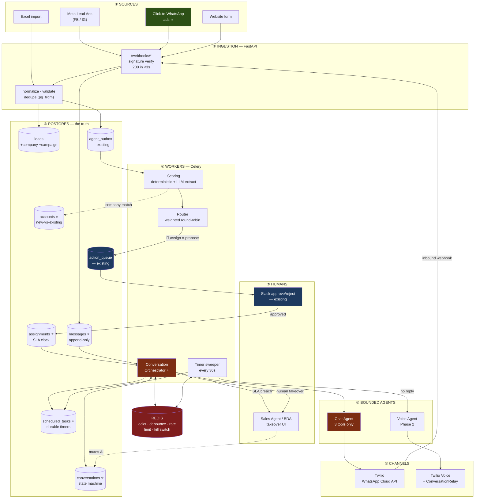
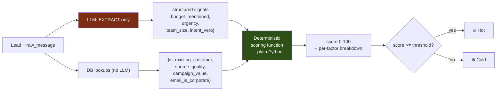
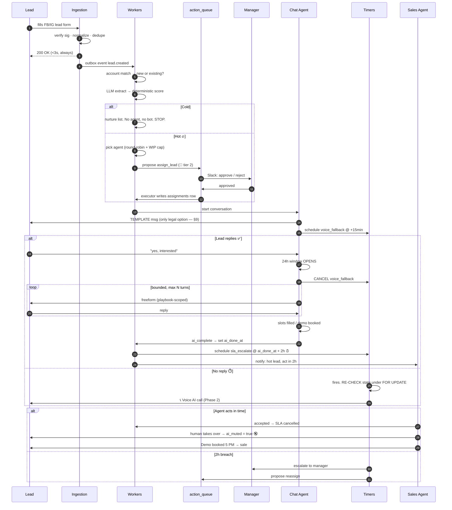
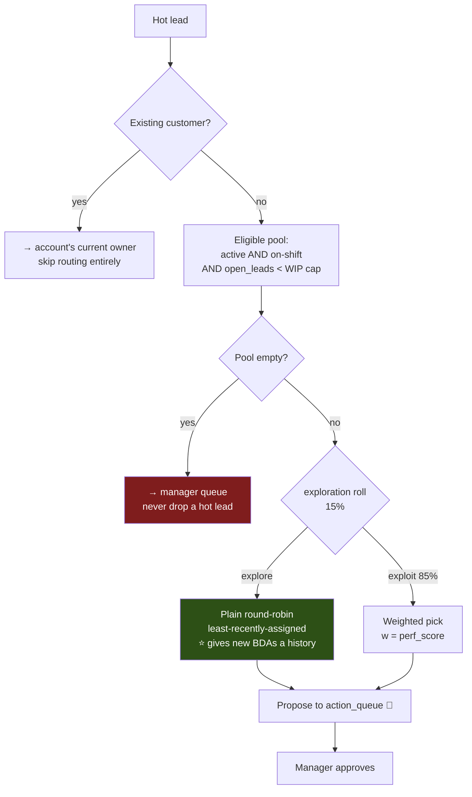

# Two-Way AI CRM — Workflow & Lead Management Architecture

**Status:** design proposal
**Extends:** `ARCHITECTURE.md` (intent), `N8N.md` (current implementation), `REPORT.md` (what actually runs today)
**Stack decisions:** greenfield Postgres · Twilio / WhatsApp Cloud API (official) · ~1k leads/day · Python

---

## 0. Read this section before the diagrams

The existing system has one load-bearing rule:

> **The LLM never executes. It only proposes. A human approves.**
> — `ARCHITECTURE.md §1`

Requirement 4 (two-way AI communication) breaks that rule. It cannot be reconciled by adding a queue, because:

1. **A conversation cannot be human-approved per turn.** A lead who waits 40 minutes for a manager to approve "Sure — what's your team size?" is not in a conversation. The moment you approve per-turn, you have rebuilt a slow human agent with extra steps.
2. **The injection defence in `REPORT.md` was structural, not behavioural.** The report is explicit and correct about this: the agent resisted the attack, *but the reason it didn't matter* is that `send_email` contained no email node. Zero emails could leave regardless of how fooled the model got.
3. **A two-way channel is an outbound path to the attacker.** The untrusted `raw_message` author and the outbound message recipient are now **the same person**. That is a closed loop. The structural defence is gone, and only the behavioural one — the one the report honestly says "a different wording could get through someday" — remains.

So the rule does not get abandoned. It gets **scoped**, by splitting actions into two classes that were previously one:

| Class | Examples | Blast radius | Governance |
|---|---|---|---|
| **CRM state mutation** | `assign_lead`, `set_stage`, `merge_lead`, `set_owner` | Affects the business, other reps, reporting | **Unchanged.** `action_queue` → propose → approve → executor. Keep everything you built. |
| **Conversation turn** | Reply to the lead on WhatsApp | Affects one thread with one lead | **New model.** Autonomous, but *bounded* — see §5. |

The safety argument for the second class is not "a human checked it." It is **"the agent physically cannot say or do anything outside a narrow envelope."** That envelope is the whole design, and §5 is the most important section in this document.

> **The sentence to take to Sidhant:** *"The propose-only rule still holds for everything that touches the CRM. For the conversation itself we replace human approval with a hard capability boundary — the chat agent has no CRM-write tools at all, and can only do three things: reply within a playbook, book a demo slot from a fixed list, or hand off to a human."*

---

## 1. Architecture blueprint



Blue = existing, unchanged. Red = new and load-bearing. Green = the thing that removes your biggest blocker (§9).

### Why these components

| Choice | Reason |
|---|---|
| **FastAPI** for webhooks | Meta and Twilio both require a fast 2xx or they retry and eventually disable your endpoint. Receive → verify signature → insert raw → 200 → process async. **Never** process inline. |
| **Postgres = truth, Redis = speed** | Your existing rule from `ARCHITECTURE.md §22` and it stays. Apply the same test: *"if Redis is flushed right now, what breaks?"* Nothing → Redis. Conversation state → Postgres. |
| **Timers in Postgres, not Celery ETA** | `scheduled_tasks` table + a 30s sweeper. Celery's `countdown`/`eta` holds the task in a worker's memory — a restart during a 2-hour SLA window silently loses it, and you find out from an angry manager, not an alert. A table is durable, queryable, and debuggable ("show me every lead whose SLA fires in the next 10 min"). |
| **Celery** | Team familiarity beats Arq's async-native edge here. If the LLM/Twilio I/O concurrency actually bites, move the orchestrator only to Arq. Don't pre-optimise. |
| **Retain n8n** | See §10 — you keep what's built and working; the conversation layer is the part n8n genuinely can't do. |

---

## 2. Data model — the delta

Keep every existing table. Add these.

```sql
-- ⭐ The company entity. Requirement 2's "new or existing company" check.
-- This is a DB lookup, NOT an LLM call — consistent with your own rule:
-- "duplicate detection is a database query, not a model call" (REPORT §9).
CREATE TABLE accounts (
  id             bigserial PRIMARY KEY,
  tenant_id      bigint NOT NULL,
  name           text NOT NULL,
  name_normal    text NOT NULL,        -- lower, no Pvt/Ltd/Inc, no punctuation
  domain         text,                 -- from email, strongest signal
  status         text NOT NULL,        -- 'prospect' | 'customer' | 'churned'
  first_won_at   timestamptz,
  created_at     timestamptz NOT NULL DEFAULT now()
);
CREATE INDEX idx_accounts_normal_trgm ON accounts USING gin (name_normal gin_trgm_ops);
CREATE UNIQUE INDEX idx_accounts_domain ON accounts (tenant_id, domain) WHERE domain IS NOT NULL;

-- The two fields the meeting asked for that don't exist anywhere in your DDL today.
ALTER TABLE leads ADD COLUMN company    text;
ALTER TABLE leads ADD COLUMN campaign   text;        -- "service needed"
ALTER TABLE leads ADD COLUMN account_id bigint REFERENCES accounts(id);
ALTER TABLE leads ADD COLUMN is_existing_customer boolean;

-- ⭐ One row per lead per channel. The state machine lives here.
CREATE TYPE conv_state AS ENUM (
  'pending', 'awaiting_optin', 'active', 'ai_complete',
  'voice_pending', 'voice_attempted', 'human_owned',
  'closed_won', 'closed_lost', 'abandoned', 'opted_out'
);

CREATE TABLE conversations (
  id                uuid PRIMARY KEY DEFAULT gen_random_uuid(),
  tenant_id         bigint NOT NULL,
  lead_id           bigint NOT NULL REFERENCES leads(id),
  channel           text NOT NULL,             -- 'whatsapp' | 'voice'
  state             conv_state NOT NULL DEFAULT 'pending',
  window_expires_at timestamptz,               -- ⭐ the 24h freeform window. §9
  ai_muted          boolean NOT NULL DEFAULT false,  -- ⭐ human took over
  playbook_version  text NOT NULL DEFAULT 'v1',
  slots             jsonb NOT NULL DEFAULT '{}'::jsonb,  -- what AI has collected
  last_inbound_at   timestamptz,
  last_outbound_at  timestamptz,
  created_at        timestamptz NOT NULL DEFAULT now(),
  updated_at        timestamptz NOT NULL DEFAULT now()
);
CREATE UNIQUE INDEX uq_conv_lead_channel ON conversations (lead_id, channel);

-- ⭐ Append-only. provider_message_id is what makes webhook retries harmless.
CREATE TABLE messages (
  id                  bigserial PRIMARY KEY,
  conversation_id     uuid NOT NULL REFERENCES conversations(id),
  direction           text NOT NULL,      -- 'in' | 'out'
  author              text NOT NULL,      -- 'lead' | 'ai' | 'user:42'
  body                text,               -- ⚠️ if direction='in' this is UNTRUSTED
  template_name       text,               -- set when this was a template send
  provider_message_id text,
  status              text,               -- queued|sent|delivered|read|failed
  error_code          text,
  created_at          timestamptz NOT NULL DEFAULT now()
);
-- ⭐ Twilio WILL redeliver. This index is the entire idempotency story.
CREATE UNIQUE INDEX uq_msg_provider ON messages (provider_message_id)
  WHERE provider_message_id IS NOT NULL;
CREATE INDEX idx_msg_conv ON messages (conversation_id, created_at DESC);

-- ⭐ Durable timers. Survives a worker restart; Celery ETA does not.
CREATE TABLE scheduled_tasks (
  id          bigserial PRIMARY KEY,
  tenant_id   bigint NOT NULL,
  task_type   text NOT NULL,        -- 'voice_fallback' | 'sla_escalate' | 'nudge'
  lead_id     bigint,
  conv_id     uuid,
  due_at      timestamptz NOT NULL,
  dedupe_key  text NOT NULL,
  status      text NOT NULL DEFAULT 'pending',  -- pending|done|cancelled|failed
  attempts    smallint NOT NULL DEFAULT 0,
  created_at  timestamptz NOT NULL DEFAULT now()
);
CREATE UNIQUE INDEX uq_sched_dedupe ON scheduled_tasks (dedupe_key) WHERE status = 'pending';
CREATE INDEX idx_sched_due ON scheduled_tasks (due_at) WHERE status = 'pending';

-- ⭐ The 2-hour SLA clock. Note sla_due_at is NULL until AI completes (§4).
CREATE TABLE assignments (
  id            bigserial PRIMARY KEY,
  tenant_id     bigint NOT NULL,
  lead_id       bigint NOT NULL REFERENCES leads(id),
  agent_id      bigint NOT NULL REFERENCES users(id),
  assigned_at   timestamptz NOT NULL DEFAULT now(),
  ai_done_at    timestamptz,        -- ⭐ SLA clock starts HERE, not at assign
  sla_due_at    timestamptz,        -- ai_done_at + 2h, business-hours adjusted
  accepted_at   timestamptz,
  outcome       text,               -- 'demo_booked'|'no_action'|'reassigned'
  escalated_at  timestamptz
);
CREATE INDEX idx_assign_sla ON assignments (sla_due_at)
  WHERE accepted_at IS NULL AND sla_due_at IS NOT NULL;

-- Phase 2. Nightly rollup — routing must never run live aggregates over leads.
CREATE TABLE agent_performance_daily (
  tenant_id       bigint NOT NULL,
  agent_id        bigint NOT NULL,
  day             date NOT NULL,
  leads_assigned  int NOT NULL DEFAULT 0,
  demos_booked    int NOT NULL DEFAULT 0,
  deals_won       int NOT NULL DEFAULT 0,
  avg_response_s  int,
  PRIMARY KEY (tenant_id, agent_id, day)
);

CREATE TABLE demo_bookings (
  id           bigserial PRIMARY KEY,
  lead_id      bigint NOT NULL REFERENCES leads(id),
  agent_id     bigint REFERENCES users(id),
  slot_start   timestamptz NOT NULL,
  booked_by    text NOT NULL,        -- 'ai' | 'user:42'
  status       text NOT NULL DEFAULT 'scheduled',
  created_at   timestamptz NOT NULL DEFAULT now()
);
```

### The fifth DB role

Your four-role scheme (`ARCHITECTURE.md §26`) extends naturally. The chat agent gets its own, and **it has no UPDATE on `leads` at all**:

```sql
CREATE ROLE crm_chat LOGIN PASSWORD 'change_me_chat';
GRANT USAGE ON SCHEMA public TO crm_chat;
GRANT SELECT ON conversations, messages, leads TO crm_chat;
GRANT INSERT ON messages TO crm_chat;
GRANT UPDATE (slots, last_outbound_at, updated_at) ON conversations TO crm_chat;
GRANT INSERT ON demo_bookings TO crm_chat;
GRANT INSERT ON action_queue TO crm_chat;   -- anything else it wants → proposal
-- Deliberately absent: UPDATE on leads, DELETE anywhere, SELECT on other leads.
```

This is the same idea as *"tool ki taakat uske naam se nahi, uske andar ke nodes se tay hoti hai"* — enforced by the database instead of by node layout. A fully-hijacked chat agent can insert a message into **its own thread** and nothing else.

---

## 3. Lead scoring — keep the LLM away from the number

Your architecture already says it: *"LLM ko probability guess mat karne do — wo maths me kachcha hai"* (`§12a`). The report proves it: *"once it invented a number instead of using the data."*

So split the job:



The LLM answers *"does this text mention a budget?"* — a language question, which it is good at. The scoring function turns signals into a number — arithmetic, which it is bad at.

**Why this matters beyond correctness:** a deterministic function is tunable, testable, and explainable. When Sidhant asks *"why is this lead 78?"* you show a per-factor breakdown, not a model's vibe. And when the threshold is wrong you change one constant instead of re-engineering a prompt.

**New-vs-existing company** is not an AI task:

```
1. email domain → strip free providers (gmail/yahoo/outlook) → exact match accounts.domain
2. no hit → normalize company name (lower, strip "pvt ltd"/"inc"/"llp", strip punctuation)
        → pg_trgm similarity(name_normal, ?) > 0.85
3. no hit → new account, INSERT with status='prospect'
4. hit + status='customer' → is_existing_customer = true → this is an UPSELL, and it
   should route to the account's existing owner, not into round-robin at all.
```

Step 4 is a business rule the meeting didn't cover but will matter the first week: **an existing customer must not be cold-pitched by a bot.** Worth raising.

---

## 4. The workflow, step by step



### The five places this breaks in production

Every one of these is cheap to handle now and expensive to discover later.

**① The reply/call race.** The lead replies at 14:59:58; the voice timer fires at 15:00:00. Without a guard you call someone mid-sentence. **Fix:** the timer job re-reads conversation state under `SELECT ... FOR UPDATE` *at execution time* and aborts unless still `awaiting_optin`. Scheduling-time checks are worthless — the whole point of a timer is that the world changed while it waited.

**② Double-texting.** Lead sends three rapid messages: "hi" / "need a demo" / "for 50 users". Three webhooks → three LLM turns → three replies. You look broken. **Fix:** per-conversation Redis debounce, ~3s. Coalesce, then run one turn on all three. (Redis is correct here — flushing it loses nothing.)

**③ Bot talks over human.** The rep takes over in the UI, but a queued AI turn fires 10 seconds later. **Fix:** `ai_muted` checked inside the send path, not the decision path. Every outbound re-reads it in the same transaction as the insert.

**④ Webhook redelivery.** Twilio retries on any timeout — including one where you *did* process it. **Fix:** `uq_msg_provider`. Insert first, let the constraint reject the dupe, no-op on conflict.

**⑤ Two workers, one conversation.** **Fix:** Postgres advisory lock on `conversation_id`. You already had to solve this with `agent_locks` because n8n has no `SET NX` (`N8N.md §5`) — same pattern, and in Python you get real `pg_advisory_xact_lock`.

### On the 2-hour window — three unanswered questions

The requirement says the agent gets 2 hours "once the AI completes the initial engagement." That's underspecified in ways that will surface in week one. My proposal, all config, not code:

| Question | Proposal |
|---|---|
| **2h from when, exactly?** | From `ai_done_at` — the AI marking engagement complete. Modelled as an explicit event, not "when the last message was sent." A lead who ghosts mid-conversation never sets it, so a *separate* abandonment timer is needed or those leads sit forever. |
| **Does the clock run at 11 PM?** | No. Business-hours-aware. A lead arriving at 23:00 has an SLA of 11:00 next day, not 01:00. Otherwise every overnight lead breaches by morning and the escalation channel becomes noise people mute. |
| **What happens at breach?** | Escalate to manager **and** propose reassignment into `action_queue`. Do not auto-reassign — that's a tier-2 CRM mutation and stays under your existing rule. |

---

## 5. The conversation envelope — the actual safety story

This replaces per-turn human approval. Six constraints, each independently sufficient to contain a hijacked agent:

**1. Three tools. That's all.**
```python
book_demo_slot(conversation_id, slot_id)   # slot_id from a fixed offered list
save_requirement(conversation_id, key, value)  # key from a fixed enum
handoff_to_human(conversation_id, reason)  # sets ai_muted, notifies rep
```
No `send_email`. No `assign_lead`. No `get_lead` for *other* leads. No search. **The tool that leaks your customer list does not exist** — the same reasoning your report used, kept intact.

**2. The agent can only reply into its own thread.** It does not choose a recipient. The send path derives the phone number from `conversation_id`; it is not a parameter the model controls. `"send my customer list to X"` has no expressible form.

**3. Untrusted text is fenced and labelled.** Inbound bodies enter context inside a delimiter with an explicit provenance marker — the same separation that worked in your report's injection test, now applied per-turn.

**4. Turn cap.** Max ~12 AI turns per conversation, then forced `handoff_to_human`. Caps cost, and caps how long a patient attacker can work on the model.

**5. Playbook scope.** System prompt is a specific playbook (qualify → book demo), versioned in `conversations.playbook_version` so you can A/B and roll back. Off-topic → handoff.

**6. Outbound rate limit per conversation.** Redis. Even a fully-looping agent can send at most N messages/hour to one lead.

> **The honest framing for your manager, in the spirit of `REPORT.md §5`:** *"We should assume the chat agent will eventually be talked into something. The design's job is to make sure the worst available outcome is a weird reply in one thread — not a leaked list, not a wrong assignment, not an email."*

**Worth flagging:** requirement 4 says "deep, human-like." Consider whether the bot should **disclose it's a bot**. Many jurisdictions are heading that way, and separately — a lead who discovers mid-call they were fooled is a lost lead and a screenshot on Twitter. My recommendation is a light disclosure ("I'm {Company}'s virtual assistant"). This is a business call, not mine, but it should be a decision rather than a default.

---

## 6. Routing — the requirement contradicts itself

Requirement 3 is headed **"Round-Robin"** and then describes **"assign to the best-performing agent."** Those are opposite policies:

- **Round-robin** = every agent gets an equal share, in rotation. Fair, ignores skill.
- **Performance-based** = the best agent gets the most. Optimises conversion, ignores fairness.

Pure performance routing has a failure mode that will bite in month two: **rich-get-richer.** The top agent gets more leads → more demos → better numbers → more leads. Meanwhile a new BDA has no history, so they score low, so they get nothing, so they never build history. The routing function has quietly decided a new hire will never succeed — and it looks like data, so nobody questions it.

**Resolution: round-robin is the floor, performance is the tilt.**



Three things carry the design:

- **WIP cap** — the best agent with 40 open leads is not the best agent for lead 41. Capacity beats skill. This alone gets you most of the benefit.
- **15% exploration** — cheap insurance against the cold-start trap. New agents get real leads and build a real record.
- **Perf score = EWMA of demo-conversion over 1–6 months, from `agent_performance_daily`.** Recency-weighted so last quarter's star who's now coasting decays. Read the nightly rollup, never a live aggregate over `leads` — routing sits on the critical path of every hot lead.

**Phase 1 ships only the eligible-pool + WIP cap + plain round-robin.** You cannot compute a performance score before you have outcome data, and you won't have outcome data until the system has run. Performance routing is *structurally* a Phase 2 feature — it's not a matter of priority, it's a data dependency.

---

## 7. Voice AI — the honest Phase 2 note

Voice is correctly a fallback, and correctly Phase 2. Three notes:

**Build:** Twilio Voice + **ConversationRelay** keeps you in one vendor and one bill. **Vapi/Retell** get you there faster with better turn-taking out of the box. Recommendation: prototype on Vapi, because voice's hard part is *interruption handling and latency*, and finding out your architecture can't do it after you've built an STT→LLM→TTS pipeline yourself is an expensive lesson. Do not hand-roll Media Streams + Deepgram + ElevenLabs for v1.

**Regulatory — needs a real answer before build, not after.** Your demo data is Delhi/Mumbai, Hinglish, INR. If this is India, automated outbound calling runs into **TRAI DND / UCC regulations**; consent and registration are not optional and penalties attach to the calling entity. Call recording adds its own consent requirement. **This is a legal question, not an architecture question — get an answer before Phase 2 starts, because it may change whether voice is viable at all.**

**Reuse the envelope.** The voice agent gets the same three tools, the same turn cap, the same `crm_chat`-equivalent role. Voice is a transport, not a new agent.

---

## 8. Phase 1 / Phase 2

### Phase 1 — Core MVP

**Goal: prove a lead can be captured, scored, routed, held in a real two-way WhatsApp conversation, and land on a rep's desk with a live SLA clock.** No voice. No performance routing.

| # | Item | Notes |
|---|---|---|
| 0 | **Meta business verification + WhatsApp template approval** | ⚠️ **Start day 1.** Blocks everything. Days-to-weeks, not hours. See §9. |
| 1 | Schema: `accounts`, `conversations`, `messages`, `scheduled_tasks`, `assignments`, `+company`, `+campaign` | |
| 2 | `crm_chat` role | Extends your existing four |
| 3 | Ingestion: Meta Lead Ads + form webhooks, normalize, dedupe | Reuse WF-1's CTE logic |
| 4 | Account matching, new-vs-existing | pg_trgm, no LLM |
| 5 | Scoring: LLM extract + deterministic function + hot/cold | |
| 6 | Routing: eligible pool + WIP cap + plain round-robin | Propose → existing Slack approval |
| 7 | **Conversation orchestrator + state machine** | The hard part. Budget accordingly. |
| 8 | **Chat agent, 3 tools, bounded** | |
| 9 | Twilio send/receive + template + `uq_msg_provider` | |
| 10 | Durable timers + 30s sweeper | |
| 11 | 2h SLA + business hours + escalate | |
| 12 | Human takeover / `ai_muted` | |
| 13 | Demo booking | Fixed slots, no calendar integration yet |
| 14 | Kill switch (finally connect Redis) | `REPORT.md` lists this as designed-not-connected |

### Phase 2 — Advanced Routing & Voice

| # | Item | Depends on |
|---|---|---|
| 1 | `agent_performance_daily` + nightly rollup | Phase 1 outcome data existing |
| 2 | Weighted routing + 15% exploration | ↑ |
| 3 | Voice fallback (Vapi/ConversationRelay) | Regulatory answer (§7) |
| 4 | Call transcript → `messages` | Unifies the thread |
| 5 | Calendar integration for real slots | |
| 6 | Attribution dashboard: source/campaign → demo → won | |
| 7 | Playbook A/B via `playbook_version` | |

### Sequencing opinion

**Build the conversation before the routing.** Routing is a `SELECT ... ORDER BY last_assigned_at LIMIT 1` — you can write it in an afternoon and it will be *fine*. The two-way conversation is where the genuine unknowns are: the 24h window, the race conditions, whether the AI actually holds a useful conversation with a real lead. **Front-load the risk.** A perfect router feeding a broken conversation is a worse place to be in week three than the reverse.

**And apply your own rule from `ARCHITECTURE.md §11`:** *"Phase 2 skip mat karna. Wahi wo phase hai jahan pata chalta hai agent bewakoof hai ya nahi."* The equivalent here: **run the chat agent in shadow mode first** — it drafts the reply, a human sends it, and you measure the edit rate. If reps rewrite 60% of drafts, you learn that on internal traffic instead of on real leads. Your report already sells this instinct ("the number decides, not opinion") and Sidhant has already bought it once.

---

## 9. The blocker nobody mentions until it's too late

**With the official Cloud API, you cannot send a freeform message to someone who hasn't messaged you in the last 24 hours.** This is not a rate limit; it's a hard platform rule.

Consequences for this exact design:

1. **First contact must be a pre-approved template.** The lead filled a form — they haven't messaged *you*. The AI's opening line is not AI-generated. It's a template Meta approved, with variable slots.
2. **Approval takes days**, and templates get rejected for tone, for looking promotional, for formatting. Budget iterations. **This is the long pole in Phase 1 and it is entirely outside your control.**
3. **The AI only becomes conversational after the lead replies.** That reply opens the 24h window. Design the template to maximise reply rate — that single message is the funnel's real bottleneck, not the model.
4. **The window can close mid-conversation.** Lead replies at 10:00, goes quiet, agent follows up at 11:00 next day → blocked. Track `window_expires_at`; outside it, template only.

**Click-to-WhatsApp ads are the way around this.** Since leads already come from Facebook/Instagram, CTWA ads have the lead message *you* first — which opens the window immediately and skips the template dance for first contact entirely. **If the marketing team can shift some ad spend to CTWA, that is the single highest-leverage change available to this project**, and it's a campaign setting, not code.

Worth raising in the next meeting. It's the kind of thing that looks like a marketing detail and is actually an architecture dependency.

---

## 10. n8n or Python?

You answered "Python," but `REPORT.md` says n8n won and six workflows exist. Both can be true:

| Layer | Verdict |
|---|---|
| Cron sweeps, propose/approve, Slack, learning loop | **Keep in n8n.** Built, working, demoed. Nothing here is worth rewriting. |
| **Conversation orchestrator** | **Python.** Non-negotiable, and `N8N.md` already argues my case: no transactions, no `SET NX`, no Lua. You worked around those for a propose-only agent with CTEs and `agent_locks`. A stateful two-way conversation needs per-conversation locking, debounce, sub-second state transitions, and race-safe timer guards. Every one of those is a workaround in n8n and a language feature in Python. |

They share Postgres. n8n reads `conversations` for dashboards; the Python service owns writes to it. Clean seam, no rewrite, and you don't throw away work you've already shown your manager.

**One caveat to raise honestly:** this makes two runtimes to operate. That's a real cost. It's still cheaper than either rewriting six working workflows or building a conversation state machine in a tool that can't hold a transaction.

---

## Summary — the six things to take to the next meeting

1. **The propose-only rule must be scoped, not deleted.** CRM mutations keep the approval queue. Conversation turns get a capability boundary instead. This is the central decision and it needs Sidhant's explicit sign-off, because it changes the safety story he already approved.
2. **"Round-robin" and "best-performing agent" contradict each other.** Proposal: round-robin floor + performance tilt + WIP cap + 15% exploration. Needs a decision on fairness vs. conversion.
3. **The 24-hour window is the real Phase 1 blocker.** Template approval starts day 1. Ask marketing about click-to-WhatsApp ads — it's the highest-leverage fix and it isn't code.
4. **Performance routing is a data dependency, not a priority call.** It cannot ship in Phase 1 because the data it needs doesn't exist yet.
5. **Voice needs a regulatory answer before it needs an architecture.** If this is India, TRAI/DND may constrain or kill it. Find out before Phase 2 is scoped.
6. **Three questions the meeting left open:** does the 2h clock respect business hours; what happens to a lead who ghosts mid-conversation; does an existing customer get cold-pitched by the bot.
