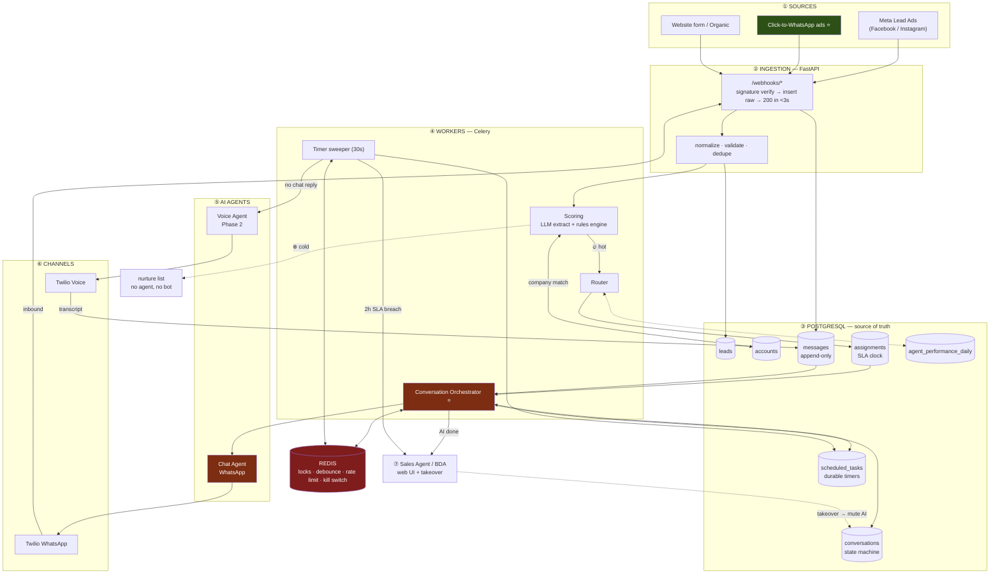
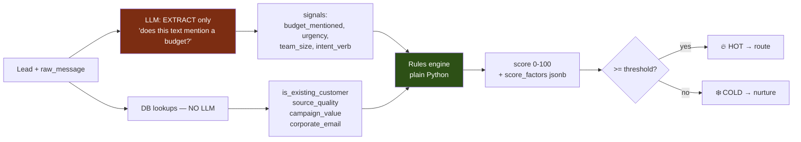
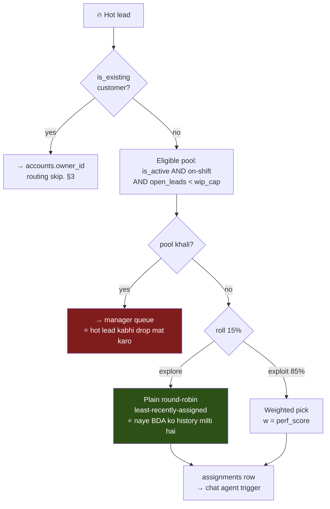

# Two-Way AI CRM — Workflow & Lead Management System

**Stack:** Python (FastAPI + Celery) · PostgreSQL · Redis · Twilio WhatsApp Cloud API · Twilio Voice
**Scale target:** ~1k leads/day
**Doc:** architecture blueprint · workflow logic · Phase 1 / Phase 2 roadmap

---

## 1. Architecture Blueprint



### Component choices — and why

| Layer | Choice | Reasoning |
|---|---|---|
| **API / webhooks** | FastAPI | Twilio and Meta both retry on slow responses, and disable your endpoint if it keeps timing out. Pattern: verify signature → insert raw row → return 200 → process async. **Never** process inline. |
| **Truth store** | PostgreSQL | Conversation state, assignments, SLA clocks. Anything whose loss would be a real incident. |
| **Speed layer** | Redis | Locks, debounce, rate limits, kill switch. Test before putting anything here: *"agar Redis abhi flush ho jaaye, kya toota?"* Nothing → Redis is correct. Data lost → Postgres. |
| **Workers** | Celery + beat | 1k/day is comfortable. Separate queues for `llm` (slow, I/O bound) and `default` so a Twilio outage can't starve scoring. |
| **Timers** | **Postgres table + 30s sweeper** | See below — this is the one non-obvious call. |
| **WhatsApp** | Twilio Cloud API | Official. No ban risk. Comes with the 24h window rule (§5). |
| **Voice** | Twilio Voice / Vapi | Phase 2. |
| **LLM** | Extraction + conversation only | Never for arithmetic. See §3. |

### Why timers live in Postgres, not Celery

Celery's `countdown` / `eta` keeps the task in a worker's memory until it fires. Deploy during a 2-hour SLA window and the timer silently vanishes — you find out from an angry manager, not an alert.

A `scheduled_tasks` table is durable across restarts, and queryable: *"show me every lead whose SLA fires in the next 10 minutes"* is a `SELECT`, not a mystery. A 30-second sweeper picks up due rows with `FOR UPDATE SKIP LOCKED`. For a system whose entire value is "act within 2 hours," the timer must be the most reliable component you own — not the most convenient.

---

## 2. Data Model

```sql
CREATE EXTENSION IF NOT EXISTS pg_trgm;

CREATE TABLE users (                         -- Sales agents / BDAs
  id           bigserial PRIMARY KEY,
  name         text NOT NULL,
  role         text NOT NULL DEFAULT 'bda',
  is_active    boolean NOT NULL DEFAULT true,
  shift_start  time, shift_end time,
  wip_cap      int NOT NULL DEFAULT 25       -- max open leads. ⭐ see §4
);

-- ⭐ Company entity — requirement 2's "new or existing company" check
CREATE TABLE accounts (
  id           bigserial PRIMARY KEY,
  name         text NOT NULL,
  name_normal  text NOT NULL,                -- lower, no "pvt ltd"/"inc", no punctuation
  domain       text,                         -- from email — strongest signal
  status       text NOT NULL,                -- 'prospect' | 'customer' | 'churned'
  owner_id     bigint REFERENCES users(id),  -- existing customer → goes to THIS person
  created_at   timestamptz NOT NULL DEFAULT now()
);
CREATE INDEX idx_acct_trgm ON accounts USING gin (name_normal gin_trgm_ops);
CREATE UNIQUE INDEX idx_acct_domain ON accounts (domain) WHERE domain IS NOT NULL;

-- Requirement 1: the capture fields
CREATE TABLE leads (
  id            bigserial PRIMARY KEY,
  name          text NOT NULL,
  phone         text NOT NULL,
  email         text,
  company       text,
  source        text,                        -- facebook | instagram | organic | ...
  campaign      text,                        -- service needed
  account_id    bigint REFERENCES accounts(id),
  is_existing   boolean,                     -- ⭐ filled by account match
  score         int,
  status        text NOT NULL DEFAULT 'new', -- new|hot|cold|engaged|demo_booked|won|lost
  score_factors jsonb,                       -- ⭐ per-factor breakdown = explainability
  raw_message   text,                        -- ⚠️ lead ne khud likha — UNTRUSTED
  created_at    timestamptz NOT NULL DEFAULT now()
);
CREATE INDEX idx_leads_status ON leads (status, created_at DESC);

-- ⭐ Requirement 4: one row per lead per channel. The state machine.
CREATE TYPE conv_state AS ENUM (
  'pending','awaiting_optin','active','ai_complete',
  'voice_pending','voice_done','human_owned',
  'demo_booked','abandoned','opted_out'
);

CREATE TABLE conversations (
  id                uuid PRIMARY KEY DEFAULT gen_random_uuid(),
  lead_id           bigint NOT NULL REFERENCES leads(id),
  channel           text NOT NULL,                    -- 'whatsapp' | 'voice'
  state             conv_state NOT NULL DEFAULT 'pending',
  window_expires_at timestamptz,                      -- ⭐ 24h freeform window. §5
  ai_muted          boolean NOT NULL DEFAULT false,   -- ⭐ human took over
  turn_count        smallint NOT NULL DEFAULT 0,      -- hard cap
  slots             jsonb NOT NULL DEFAULT '{}',      -- what AI collected
  last_inbound_at   timestamptz,
  updated_at        timestamptz NOT NULL DEFAULT now()
);
CREATE UNIQUE INDEX uq_conv ON conversations (lead_id, channel);

CREATE TABLE messages (
  id                  bigserial PRIMARY KEY,
  conversation_id     uuid NOT NULL REFERENCES conversations(id),
  direction           text NOT NULL,        -- 'in' | 'out'
  author              text NOT NULL,        -- 'lead' | 'ai' | 'user:42'
  body                text,                 -- ⚠️ direction='in' → UNTRUSTED
  template_name       text,                 -- set when this was a template send
  provider_message_id text,
  status              text,                 -- queued|sent|delivered|read|failed
  created_at          timestamptz NOT NULL DEFAULT now()
);
-- ⭐ Twilio WILL redeliver. This one index is the whole idempotency story.
CREATE UNIQUE INDEX uq_msg_provider ON messages (provider_message_id)
  WHERE provider_message_id IS NOT NULL;

-- ⭐ Durable timers
CREATE TABLE scheduled_tasks (
  id          bigserial PRIMARY KEY,
  task_type   text NOT NULL,        -- 'voice_fallback' | 'sla_escalate' | 'abandon_check'
  lead_id     bigint,
  conv_id     uuid,
  due_at      timestamptz NOT NULL,
  dedupe_key  text NOT NULL,
  status      text NOT NULL DEFAULT 'pending',
  attempts    smallint NOT NULL DEFAULT 0
);
CREATE UNIQUE INDEX uq_sched ON scheduled_tasks (dedupe_key) WHERE status = 'pending';
CREATE INDEX idx_sched_due ON scheduled_tasks (due_at) WHERE status = 'pending';

-- ⭐ Requirement 5: the 2-hour clock
CREATE TABLE assignments (
  id           bigserial PRIMARY KEY,
  lead_id      bigint NOT NULL REFERENCES leads(id),
  agent_id     bigint NOT NULL REFERENCES users(id),
  assigned_at  timestamptz NOT NULL DEFAULT now(),
  ai_done_at   timestamptz,          -- ⭐ clock starts HERE, not at assign. §6
  sla_due_at   timestamptz,          -- ai_done_at + 2h, business-hours adjusted
  accepted_at  timestamptz,
  outcome      text,                 -- demo_booked | no_action | reassigned
  escalated_at timestamptz
);
CREATE INDEX idx_sla ON assignments (sla_due_at)
  WHERE accepted_at IS NULL AND sla_due_at IS NOT NULL;

-- Phase 2 — routing reads THIS, never a live aggregate over leads
CREATE TABLE agent_performance_daily (
  agent_id       bigint NOT NULL REFERENCES users(id),
  day            date NOT NULL,
  leads_assigned int NOT NULL DEFAULT 0,
  demos_booked   int NOT NULL DEFAULT 0,
  deals_won      int NOT NULL DEFAULT 0,
  avg_response_s int,
  PRIMARY KEY (agent_id, day)
);

CREATE TABLE demo_bookings (
  id         bigserial PRIMARY KEY,
  lead_id    bigint NOT NULL REFERENCES leads(id),
  agent_id   bigint REFERENCES users(id),
  slot_start timestamptz NOT NULL,           -- e.g. today 17:00
  booked_by  text NOT NULL,                  -- 'ai' | 'user:42'
  status     text NOT NULL DEFAULT 'scheduled'
);

CREATE TABLE audit_log (                     -- append-only
  id         bigserial PRIMARY KEY,
  lead_id    bigint,
  action     text NOT NULL,
  actor      text NOT NULL,                  -- 'ai' | 'user:42' | 'system'
  before     jsonb, after jsonb,
  created_at timestamptz NOT NULL DEFAULT now()
);
```

---

## 3. Lead Scoring — keep the LLM away from the number

Requirement 2 says *"Background AI checks if the company is new or existing"* and *"assigns an initial Lead Score."* Both need splitting, because neither is fully an AI job.



**LLM ka kaam:** *"is text me budget ka zikr hai?"* — language question. Ye wo achha karta hai.
**Rules engine ka kaam:** signals → number. Arithmetic. **LLM ye kharab karta hai** — wo number invent kar deta hai.

Aur teen practical wajah:

- **Tunable.** Threshold galat nikla → ek constant badlo. Prompt re-engineer mat karo.
- **Testable.** Rules engine ka unit test likh sakte ho. Prompt ka nahi.
- **Explainable.** Manager poochhega *"ye lead 78 kyun hai?"* → `score_factors` dikha do, model ki vibe nahi.

### "New or existing company" is a DB query, not an AI call

```
1. email domain → free providers (gmail/yahoo) hatao → accounts.domain pe exact match
2. miss → company name normalize (lower, "pvt ltd"/"inc"/"llp" strip, punctuation strip)
        → pg_trgm: similarity(name_normal, ?) > 0.85
3. miss → naya account, status='prospect'
4. hit + status='customer' → is_existing = true
```

Ek LLM call yahan paisa aur latency dono waste hai — `pg_trgm` "Sharma Industries" vs "Sharma Industries Pvt Ltd" already handle kar leta hai.

**Aur step 4 pe ek business rule jo meeting me nahi aayi, par pehle hafte me aayegi:** agar lead ek **existing customer** hai, to wo round-robin me jaana hi nahi chahiye. Wo upsell hai, aur uske existing owner (`accounts.owner_id`) ko jaana chahiye. **Purane customer ko bot cold-pitch kare — ye bura dikhta hai.** Ye decide karwa lo.

---

## 4. Routing — requirement 3 khud se ladti hai

Heading likhi hai **"Round-Robin"**, andar likha hai **"best-performing agent ko assign karo"**. Ye do opposite policy hain:

- **Round-robin** → sabko barabar, rotation me. Fair. Skill ignore karta hai.
- **Performance-based** → achhe agent ko zyada. Conversion optimise karta hai. Fairness ignore karta hai.

Aur pure performance me ek trap hai jo mahine do mahine me kaatega — **rich get richer:**

> Top agent ko zyada lead → zyada demo → behtar numbers → aur zyada lead.
> Naya BDA: koi history nahi → score kam → lead milti hi nahi → history banti hi nahi.

Router ne chupchaap decide kar liya ki naya hire kabhi safal nahi hoga. Aur ye **data jaisa dikhta hai**, isliye koi sawal nahi uthata.

### Resolution: round-robin = floor, performance = tilt



Teen cheezein kaam kar rahi hain:

- **WIP cap** — 40 open lead wala best agent, lead 41 ke liye best nahi hai. **Capacity beats skill.** Akela yahi 80% faayda de deta hai.
- **15% exploration** — cold-start trap ka sasta insurance. Naye BDA ko asli lead milti hai, asli record banta hai.
- **perf_score** = demo-conversion ka EWMA over 1–6 months, `agent_performance_daily` se. Recency-weighted, taaki pichhle quarter ka star jo ab dheela pad gaya hai, decay ho jaaye. **Nightly rollup padho, live aggregate kabhi nahi** — routing har hot lead ke critical path pe baithi hai.

### ⚠️ Performance routing Phase 1 me ho hi nahi sakta

Ye priority ka faisla nahi hai, **data dependency hai.** perf_score ke liye outcome data chahiye (kitne demo book hue, kitne deal bane). Wo data Phase 1 chalne ke **baad** banega. Phase 1 me plain round-robin + WIP cap hi ja sakta hai — aur wo theek hai.

---

## 5. ⚠️ Requirement 4 ka asli blocker — 24-hour window

**Official WhatsApp Cloud API me: jisne tumhe pichhle 24 ghante me message nahi kiya, use freeform message bhej hi nahi sakte.** Ye rate limit nahi — hard platform rule hai.

Is design pe iska seedha asar:

| # | Asar |
|---|---|
| **1** | **Pehli line AI likh hi nahi sakta.** Lead ne form bhara, tumhe message nahi kiya. To opening message = **Meta-approved template**, variable slots ke saath. |
| **2** | **Approval me din lagte hain.** Reject bhi hota hai — tone, promotional dikhne pe, formatting pe. **Ye Phase 1 ka sabse lamba pole hai aur poori tarah tumhare control ke bahar hai.** |
| **3** | **AI conversational tabhi banta hai jab lead reply kare.** Wo reply 24h window kholti hai. Matlab **template ka reply-rate hi asli funnel bottleneck hai — model nahi.** |
| **4** | **Window beech me band ho sakti hai.** Lead ne 10:00 baje reply kiya, chup ho gaya, agle din 11:00 baje follow-up → blocked. `window_expires_at` track karo; bahar ho to template only. |

### ⭐ Iska jugaad: Click-to-WhatsApp ads

Leads already Facebook/Instagram se aa rahi hain. **CTWA ads me lead khud tumhe message karta hai** → window turant khulti hai → first contact ka template jhanjhat **poora khatam.**

**Ye code nahi hai — campaign setting hai.** Marketing team se poochho. Poore project ka sabse zyada leverage isi ek cheez me hai, aur ye marketing detail jaisi dikhti hai jabki asal me **architecture dependency** hai.

**Agli meeting me ye uthana.**

---

## 6. Workflow — step by step

```mermaid
sequenceDiagram
    autonumber
    participant L as Lead
    participant IN as Ingestion
    participant W as Workers
    participant C as Chat Agent
    participant T as Timers
    participant V as Voice AI
    participant R as Sales Agent

    L->>IN: FB/IG lead form bhara
    IN->>IN: sig verify · normalize · dedupe
    IN-->>L: 200 OK (&lt;3s, hamesha)

    W->>W: account match → new ya existing?
    W->>W: LLM extract → rules engine → score
    alt ❄️ Cold
        W->>W: nurture list. Koi agent nahi, koi bot nahi. STOP.
    else 🔥 Hot
        W->>W: eligible pool → round-robin → assignments row
        W->>R: notify: nayi hot lead
    end

    W->>C: conversation start
    C->>L: TEMPLATE message (§5 — akela legal option)
    C->>T: schedule voice_fallback @ +15min

    alt Lead reply karta hai ✅
        L->>C: "haan, interested"
        C->>C: 24h window KHULI
        C->>T: ❌ CANCEL voice_fallback
        loop max 12 turns
            C->>L: freeform reply (playbook scope me)
            L->>C: reply
        end
        C->>C: slots bhare / demo book hua
        C->>W: ai_complete → ai_done_at set
        W->>T: schedule sla_escalate @ ai_done_at + 2h ⏰
        W->>R: "hot lead ready — 2 ghante me act karo"
    else Reply nahi aaya ⏱️
        T->>T: fire. State RE-CHECK under FOR UPDATE ⚠️
        T->>V: trigger
        V->>L: 📞 call
        V->>W: transcript → messages
    end

    alt Agent time pe act kiya
        R->>W: accepted → SLA cancel
        R->>L: takeover → ai_muted = true 🔇
        R->>L: Demo 5 PM book → sale
    else 2h breach ⏰
        T->>R: manager ko escalate
        T->>W: reassign propose
    end
```

### ⚠️ Paanch jagah ye production me tootega

Har ek abhi sasta hai, baad me mehenga.

**① Reply/call race — sabse gandi.** Lead ne 14:59:58 pe reply kiya, voice timer 15:00:00 pe fire hua. Guard ke bina tum use call kar doge jab wo abhi type kar raha hai.
→ **Fix:** timer job **execution ke waqt** `SELECT ... FOR UPDATE` se state dobara padhe, aur `awaiting_optin` na ho to abort kare. Schedule-time check bekaar hai — **timer ka poora point hi yehi hai ki wait ke dauraan duniya badal gayi.**

**② Double-texting.** Lead ne teen message thok diye: "hi" / "demo chahiye" / "50 users ke liye". Teen webhook → teen LLM turn → teen reply. Tum broken dikhte ho.
→ **Fix:** per-conversation Redis debounce, ~3s. Coalesce karke ek turn chalao.

**③ Bot insaan ke upar bolta hai.** Rep ne UI me takeover kiya, par 10 second pehle queue hua AI turn ab fire ho gaya.
→ **Fix:** `ai_muted` **send path me** check karo, decision path me nahi. Har outbound usi transaction me flag dobara padhe jisme insert ho raha hai.

**④ Webhook redelivery.** Twilio timeout pe retry karta hai — us case me bhi jab tumne process kar hi liya tha.
→ **Fix:** `uq_msg_provider`. Insert maaro, constraint dupe ko reject karega, `ON CONFLICT DO NOTHING`.

**⑤ Do worker, ek conversation.**
→ **Fix:** `pg_advisory_xact_lock(conversation_id)`.

### Requirement 5 ke teen adhoore sawal

Likha hai *"agent gets a 2-hour window once the AI completes the initial engagement."* Teen cheezein khuli hain jo pehle hafte me hi saamne aayengi:

| Sawal | Mera proposal |
|---|---|
| **2 ghante kab se?** | `ai_done_at` se — AI ke engagement complete karne se. Ise **explicit event** banao, "last message ka time" nahi. **Catch:** jo lead beech me ghost kar de, uska `ai_done_at` kabhi set hi nahi hoga — wo hamesha ke liye latki rahegi. Isliye alag `abandon_check` timer chahiye. |
| **Raat 11 baje clock chalega?** | **Nahi.** Business-hours aware. 23:00 wali lead ka SLA agli subah 11:00, raat 1 baje nahi. Warna har raat ki lead subah tak breach ho jaayegi, escalation channel shor ban jaayega, aur log **use mute kar denge** — jo poore feature ko maar deta hai. |
| **Breach pe hota kya hai?** | Manager ko escalate **+** reassign propose karo. **Auto-reassign mat karo** — lead chupchaap kisi aur ke paas chali jaaye aur pehle agent ko pata bhi na chale, ye trust todta hai. |

---

## 7. Conversation ko bounded rakhna — safety

Requirement 4 me AI khud lead se baat karega. Matlab **jo banda untrusted text likh raha hai aur jisko reply jaa raha hai — wo same aadmi hai.** Loop band hai. Isliye envelope chahiye:

**1. Sirf teen tool. Bas.**
```python
book_demo_slot(conversation_id, slot_id)        # slot_id ek fixed offered list se
save_requirement(conversation_id, key, value)   # key ek fixed enum se
handoff_to_human(conversation_id, reason)       # ai_muted set, rep ko notify
```
Koi `send_email` nahi. Koi `assign_lead` nahi. Doosri leads ka koi search nahi. **Jo tool customer list leak karega, wo exist hi nahi karta.**

**2. Recipient model choose nahi karta.** Phone number `conversation_id` se derive hota hai — parameter nahi hai. *"Meri list X pe bhej do"* ka koi expressible form hi nahi banta.

**3. Apna DB role.** `crm_chat`: `messages` pe INSERT, `conversations.slots` pe UPDATE. **`leads` pe UPDATE bilkul nahi.** Deewar database enforce karti hai, prompt nahi.

**4. Turn cap.** ~12 turn, phir forced handoff. Cost cap karta hai, aur ek patient attacker ka time bhi cap karta hai.

**5. Playbook scope.** System prompt ek specific playbook (qualify → demo book). Off-topic → handoff.

**6. Untrusted text fenced.** Inbound body delimiter ke andar, explicit provenance marker ke saath.

**7. Per-conversation rate limit.** Redis. Loop me phasa agent bhi ek lead ko max N msg/hour bhej sakta hai.

> **Framing:** *"Maan ke chalo ki chat agent ko kabhi na kabhi baat me phasa liya jaayega. Design ka kaam ye hai ki us din ka worst outcome ek thread me ek weird reply ho — leaked list nahi, galat assignment nahi, email nahi."*

**Aur ek business call:** requirement me "human-like" likha hai. **Bot ko bot batana chahiye ya nahi?** Meri salaah — halka disclosure (*"main {Company} ka virtual assistant hoon"*). Jis lead ko beech me pata chale ki use bewakoof banaya gaya, wo gayi lead + screenshot. Ye business decision hai, par **decision hona chahiye — default nahi.**

---

## 8. Voice AI — Phase 2

**Build:** **Vapi / Retell** pe prototype karo. Twilio ConversationRelay ek vendor me rakhta hai, par voice ka mushkil hissa **interruption handling aur latency** hai. Khud Media Streams + Deepgram + ElevenLabs pipeline banake pata chale ki turn-taking nahi ho raha — ye mehenga sabak hai. **v1 me hand-roll mat karo.**

**⚠️ Regulatory — build se pehle jawab chahiye.** Agar India hai to automated outbound calling pe **TRAI / DND / UCC** lagta hai. Consent aur registration optional nahi hain, aur penalty calling entity pe aati hai. Call recording ka apna consent chahiye.
**Ye legal sawal hai, architecture ka nahi. Phase 2 scope karne se pehle jawab lo — ho sakta hai voice viable hi na ho.**

**Envelope reuse karo.** Voice agent ko wahi 3 tool, wahi turn cap, wahi DB role. **Voice ek transport hai, naya agent nahi.**

---

## 9. Roadmap

### Phase 1 — Core MVP

**Goal:** lead capture ho → score ho → route ho → **asli two-way WhatsApp conversation** chale → rep ke paas live 2h clock ke saath pahunche.
**Nahi hai:** voice, performance routing.

| # | Item | Note |
|---|---|---|
| **0** | **Meta business verification + WhatsApp template approval** | ⚠️ **Din 1 se shuru.** Sab kuch block karta hai. §5 |
| 1 | Schema (§2) | |
| 2 | Ingestion: Meta Lead Ads + form webhook, normalize, dedupe | |
| 3 | Account match → new/existing (`pg_trgm`, no LLM) | §3 |
| 4 | Scoring: LLM extract + rules engine + hot/cold | §3 |
| 5 | Routing: eligible pool + WIP cap + **plain round-robin** | §4 |
| 6 | **Conversation orchestrator + state machine** | ⭐ **sabse hard. Time yahan lagega.** |
| 7 | **Chat agent — 3 tools, bounded** | §7 |
| 8 | Twilio send/receive + template + `uq_msg_provider` | |
| 9 | Durable timers + 30s sweeper | |
| 10 | 2h SLA + business hours + escalate | §6 |
| 11 | Human takeover / `ai_muted` | |
| 12 | Demo booking (fixed slots, abhi calendar nahi) | |
| 13 | Rep UI: my leads, thread view, takeover, accept | |
| 14 | Kill switch (Redis) + audit log | |

### Phase 2 — Advanced Routing & Voice AI

| # | Item | Depends on |
|---|---|---|
| 1 | `agent_performance_daily` + nightly rollup | Phase 1 ka outcome data |
| 2 | Weighted routing + 15% exploration | ↑ |
| 3 | Voice fallback (Vapi / ConversationRelay) | **Regulatory jawab (§8)** |
| 4 | Call transcript → `messages` (ek hi thread) | |
| 5 | Calendar integration (asli slots) | |
| 6 | Attribution dashboard: source/campaign → demo → won | |
| 7 | Playbook A/B | |

### Sequencing — do salaah

**1. Routing se pehle conversation banao.** Routing ek `ORDER BY last_assigned_at LIMIT 1` hai — ek shaam ka kaam, aur wo **theek chalega.** Asli unknown conversation me hai: 24h window, race conditions, aur sabse bada — **kya AI asli lead ke saath kaam ki baat kar bhi paata hai?**
**Risk front-load karo.** Hafte teen me "perfect router + toota conversation" us se kahin bura hai jitna ulta.

**2. Shadow mode pehle chalao.** AI reply **draft** kare, insaan bheje, aur **edit rate naapo.** Agar reps 60% draft rewrite kar rahe hain, to ye baat internal traffic pe pata chale — asli lead pe nahi. Do hafte shadow, phir number dekh ke decide karo. **Number decide karega, opinion nahi.**

---

## 10. Agli meeting me ye 6 cheezein uthao

1. **"Round-robin" aur "best-performing agent" ek doosre ke ulat hain.** Proposal: round-robin floor + performance tilt + WIP cap + 15% exploration. Fairness vs conversion pe **decision chahiye.**
2. **24h window Phase 1 ka asli blocker hai.** Template approval din 1 se. **Marketing se click-to-WhatsApp ads poochho** — sabse bada leverage, aur wo code nahi hai.
3. **Performance routing Phase 1 me ja hi nahi sakta** — data dependency hai, priority nahi.
4. **Voice ko architecture se pehle legal jawab chahiye.** India hai to TRAI/DND scope badal ya khatam kar sakta hai.
5. **Bot apne aap ko bot batayega ya nahi?** Business decision — default nahi.
6. **Teen khule sawal:** (a) 2h clock business hours respect karega? (b) jo lead beech me ghost kar de uska kya? (c) existing customer ko bot cold-pitch karega?
