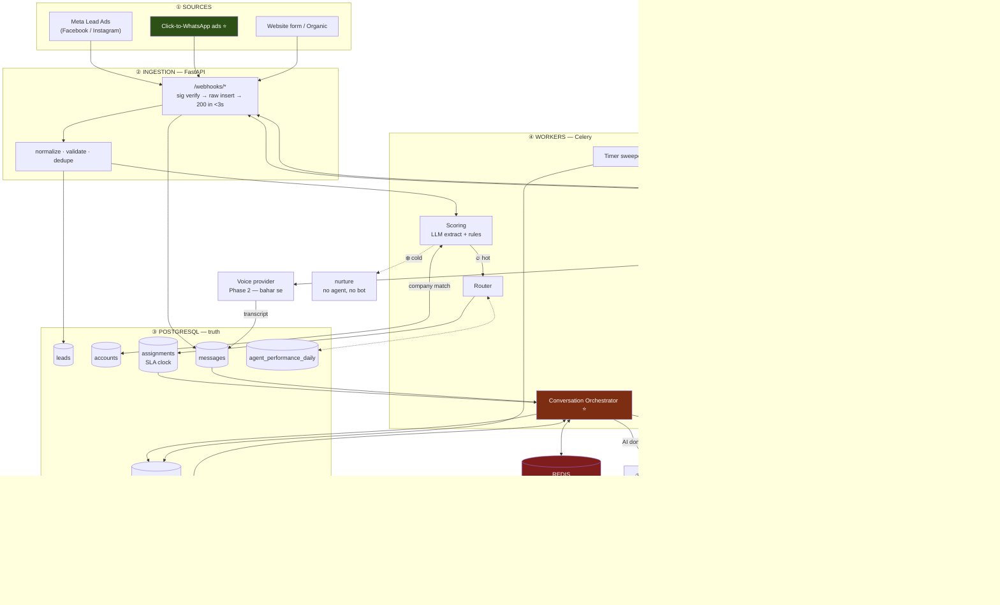
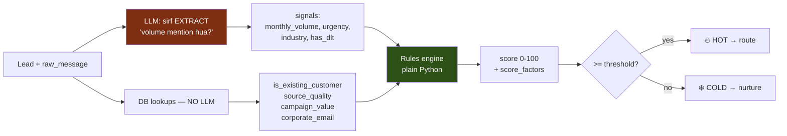
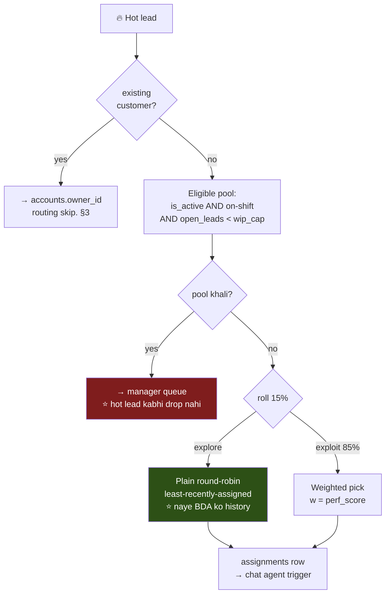

# NotifyTechAi — Two-Way AI CRM & Lead Management System

**Company:** NotifyTechAi — Bulk WhatsApp Business API & SMS Solutions (India)
**Stack:** Python (FastAPI + Celery) · PostgreSQL · Redis · **NotifyTechAi ka apna WhatsApp/SMS/RCS platform**
**Scale:** ~1k leads/day

> ### ⚠️ Assumptions — confirm kar lo
> Ye do cheezein confirm nahi hui thi, maine assume ki hain. Galat ho to bata do — dono chhote fix hain.
> 1. **Tum official Meta BSP ho** (Meta ke saath direct ya reseller relationship), kisi aur BSP ke upar layer nahi. Isse template approval ka control tumhare paas hai.
> 2. **Services = WhatsApp Business API · Bulk SMS · RCS** — yahi `campaign` field ki values hain. Aur kuch ho to add kar dena.

---

## 0. Sabse pehle — ek strategic baat

**Tum ek WhatsApp Business API company ho, jo apni leads ko WhatsApp pe handle karne wali hai.**

Iske teen bade natije hain, aur teenon architecture ko badalte hain:

**1. Twilio nahi. Apna platform.**
Twilio tumhara **competitor** hai. Us par CRM banana matlab apne hi product ke liye competitor ko paisa dena — aur apne product pe bharosa na dikhana. **Messaging layer tumhare apne API pe chalegi.**

**2. Ye internal tool nahi, live case study hai.**
Har demo me ye line hai: *"jo AI abhi aapse WhatsApp pe baat kar raha tha — wahi hum aapko bech rahe hain."* **Ye sales asset hai, tool nahi.**

**3. Dogfooding se product khud sudhrega.**
Tumhari sales team apne product ki dikkatein **khud jhelegi.** Jo bug customer ko dikhta hai, wo pehle tumhe dikhega. **Ye product ke liye sabse achhi cheez hai.**

> ⚠️ **Iska ek risk bhi hai, aur wo bolna zaroori hai:** agar tumhara platform down hua, to tumhari **lead-gen bhi usi second ruk jaayegi** — theek us waqt jab customers bhi complain kar rahe honge. Ye actually **feature hai** (outage turant pata chalega), par ye decision consciously lena chahiye, galti se nahi.

---

## 1. Architecture Blueprint



**Hara block = tumhara apna product.** Poore system me sirf **voice** bahar se aayega (Phase 2) — baaki sab in-house.

### Component choices

| Layer | Choice | Wajah |
|---|---|---|
| **API / webhooks** | FastAPI | Meta aur tumhara apna platform dono retry karte hain slow response pe. Pattern: **sig verify → raw insert → 200 → async process.** Inline kabhi mat karo. |
| **Truth** | PostgreSQL | Conversation state, assignments, SLA clocks. |
| **Speed** | Redis | Locks, debounce, rate limit, kill switch. Test: *"Redis abhi flush ho jaaye, kya toota?"* Kuch nahi → Redis sahi. Data gaya → Postgres. |
| **Workers** | Celery + beat | Alag queue: `llm` (slow) aur `default`. Taaki LLM slow ho to scoring na ruke. |
| **Timers** | **Postgres table + 30s sweeper** | Neeche dekho — ye ek non-obvious call hai. |
| **Messaging** | **🏠 Apna platform** | Internal API call. Twilio nahi. |
| **Voice** | Vapi / Retell (Phase 2) | Sirf yahi bahar se. §8 |
| **LLM** | Extract + converse only | Arithmetic kabhi nahi. §3 |

### 🏠 Messaging ko apne platform pe chalane ka matlab

| Faayda | Kya badalta hai |
|---|---|
| **Zero vendor cost** | Message cost internal transfer hai, Twilio bill nahi. |
| **Template control tumhare paas** | BSP hone ka faayda — approval pipeline tumhare andar hai. §5 |
| **DLT compliance ready** | SMS ke liye tumhara DLT setup already hai. |
| **Debugging aasaan** | Message stuck hai to tum **apni** logs dekh sakte ho, support ticket nahi kaatna padta. |
| **RCS free me mil gaya** | Ek extra channel jo competitors ke paas nahi. §5 |

> **⚠️ Ek design rule — abhi lagao, baad me bachayega:** messaging ko ek **thin adapter interface** ke peechhe rakho (`send_message(channel, to, body)`). Apna platform hi implementation hoga. **Wajah:** kal ko kisi client ke liye ye CRM alag platform pe chalana pade, ya apne platform ka koi region down ho — to ek class badlegi, poora orchestrator nahi. **Ye 20 line ka kaam hai, aur ye sirf tab dikhega jab iski zaroorat padegi.**

### Timers Postgres me kyun, Celery me kyun nahi

Celery ka `countdown`/`eta` task ko worker ki **memory** me rakhta hai. **2 ghante ke SLA window ke beech me deploy kiya → timer chupchaap gayab.** Aur pata chalega manager ke gusse se, alert se nahi.

`scheduled_tasks` table restart ke baad bhi zinda rehti hai, aur **queryable** hai: *"agle 10 minute me kiska SLA fire hoga?"* ek `SELECT` hai, mystery nahi. 30-second sweeper `FOR UPDATE SKIP LOCKED` se due rows uthata hai.

**Jis system ki poori keemat hi "2 ghante me action" hai — uska timer sabse reliable cheez honi chahiye, sabse convenient nahi.**

---

## 2. Data Model

```sql
CREATE EXTENSION IF NOT EXISTS pg_trgm;

CREATE TABLE users (                          -- Sales agents / BDAs
  id          bigserial PRIMARY KEY,
  name        text NOT NULL,
  role        text NOT NULL DEFAULT 'bda',
  is_active   boolean NOT NULL DEFAULT true,
  shift_start time, shift_end time,
  wip_cap     int NOT NULL DEFAULT 25         -- max open leads. ⭐ §4
);

CREATE TABLE accounts (
  id          bigserial PRIMARY KEY,
  name        text NOT NULL,
  name_normal text NOT NULL,                  -- lower, "pvt ltd"/"inc" strip, punctuation strip
  domain      text,                           -- email se — sabse strong signal
  status      text NOT NULL,                  -- 'prospect' | 'customer' | 'churned'
  owner_id    bigint REFERENCES users(id),    -- existing customer → ISKO jaayega, round-robin nahi
  created_at  timestamptz NOT NULL DEFAULT now()
);
CREATE INDEX idx_acct_trgm ON accounts USING gin (name_normal gin_trgm_ops);
CREATE UNIQUE INDEX idx_acct_domain ON accounts (domain) WHERE domain IS NOT NULL;

CREATE TABLE leads (
  id            bigserial PRIMARY KEY,
  name          text NOT NULL,
  phone         text NOT NULL,                -- E.164, +91 normalize
  email         text,
  company       text,
  source        text,                         -- facebook | instagram | organic | ctwa | referral
  campaign      text,                         -- ⭐ 'whatsapp_api' | 'bulk_sms' | 'rcs'
  account_id    bigint REFERENCES accounts(id),
  is_existing   boolean,
  score         int,
  status        text NOT NULL DEFAULT 'new',  -- new|hot|cold|engaged|demo_booked|won|lost
  score_factors jsonb,                        -- ⭐ per-factor breakdown = explainability
  raw_message   text,                         -- ⚠️ lead ne khud likha — UNTRUSTED
  created_at    timestamptz NOT NULL DEFAULT now()
);
CREATE INDEX idx_leads_status ON leads (status, created_at DESC);

-- ⭐ Requirement 4 — state machine
CREATE TYPE conv_state AS ENUM (
  'pending','awaiting_optin','active','ai_complete',
  'voice_pending','voice_done','human_owned',
  'demo_booked','abandoned','opted_out'
);

CREATE TABLE conversations (
  id                uuid PRIMARY KEY DEFAULT gen_random_uuid(),
  lead_id           bigint NOT NULL REFERENCES leads(id),
  channel           text NOT NULL,                  -- 'whatsapp'|'rcs'|'sms'|'voice'
  state             conv_state NOT NULL DEFAULT 'pending',
  window_expires_at timestamptz,                    -- ⭐ 24h window. §5
  ai_muted          boolean NOT NULL DEFAULT false, -- ⭐ insaan ne takeover kiya
  turn_count        smallint NOT NULL DEFAULT 0,    -- hard cap
  slots             jsonb NOT NULL DEFAULT '{}',    -- AI ne kya collect kiya
  last_inbound_at   timestamptz,
  updated_at        timestamptz NOT NULL DEFAULT now()
);
CREATE UNIQUE INDEX uq_conv ON conversations (lead_id, channel);

CREATE TABLE messages (
  id                  bigserial PRIMARY KEY,
  conversation_id     uuid NOT NULL REFERENCES conversations(id),
  direction           text NOT NULL,        -- 'in' | 'out'
  author              text NOT NULL,        -- 'lead' | 'ai' | 'user:42'
  body                text,                 -- ⚠️ direction='in' → UNTRUSTED
  template_name       text,
  provider_message_id text,                 -- apne platform ka message id
  status              text,                 -- queued|sent|delivered|read|failed
  created_at          timestamptz NOT NULL DEFAULT now()
);
-- ⭐ Webhook retry hoga hi. Ye ek index poori idempotency story hai.
CREATE UNIQUE INDEX uq_msg_provider ON messages (provider_message_id)
  WHERE provider_message_id IS NOT NULL;

CREATE TABLE scheduled_tasks (
  id         bigserial PRIMARY KEY,
  task_type  text NOT NULL,           -- 'voice_fallback'|'sla_escalate'|'abandon_check'
  lead_id    bigint,
  conv_id    uuid,
  due_at     timestamptz NOT NULL,
  dedupe_key text NOT NULL,
  status     text NOT NULL DEFAULT 'pending',
  attempts   smallint NOT NULL DEFAULT 0
);
CREATE UNIQUE INDEX uq_sched ON scheduled_tasks (dedupe_key) WHERE status = 'pending';
CREATE INDEX idx_sched_due ON scheduled_tasks (due_at) WHERE status = 'pending';

-- ⭐ Requirement 5 — 2 ghante ka clock
CREATE TABLE assignments (
  id           bigserial PRIMARY KEY,
  lead_id      bigint NOT NULL REFERENCES leads(id),
  agent_id     bigint NOT NULL REFERENCES users(id),
  assigned_at  timestamptz NOT NULL DEFAULT now(),
  ai_done_at   timestamptz,           -- ⭐ clock YAHAN se, assign se nahi. §6
  sla_due_at   timestamptz,           -- ai_done_at + 2h, business-hours adjusted
  accepted_at  timestamptz,
  outcome      text,                  -- demo_booked | no_action | reassigned
  escalated_at timestamptz
);
CREATE INDEX idx_sla ON assignments (sla_due_at)
  WHERE accepted_at IS NULL AND sla_due_at IS NOT NULL;

-- Phase 2 — routing ISKO padhega, live aggregate kabhi nahi
CREATE TABLE agent_performance_daily (
  agent_id       bigint NOT NULL REFERENCES users(id),
  day            date NOT NULL,
  leads_assigned int NOT NULL DEFAULT 0,
  demos_booked   int NOT NULL DEFAULT 0,
  deals_won      int NOT NULL DEFAULT 0,
  avg_response_s int,
  PRIMARY KEY (agent_id, day)
);

CREATE TABLE demo_bookings (
  id         bigserial PRIMARY KEY,
  lead_id    bigint NOT NULL REFERENCES leads(id),
  agent_id   bigint REFERENCES users(id),
  slot_start timestamptz NOT NULL,            -- e.g. aaj 17:00
  booked_by  text NOT NULL,                   -- 'ai' | 'user:42'
  status     text NOT NULL DEFAULT 'scheduled'
);

CREATE TABLE audit_log (                      -- append-only
  id         bigserial PRIMARY KEY,
  lead_id    bigint,
  action     text NOT NULL,
  actor      text NOT NULL,                   -- 'ai' | 'user:42' | 'system'
  before     jsonb, after jsonb,
  created_at timestamptz NOT NULL DEFAULT now()
);
```

---

## 3. Scoring — LLM ko number se door rakho



**LLM ka kaam:** *"is text me volume ka zikr hai?"* — language question. Isme wo achha hai.
**Rules engine ka kaam:** signals → number. Arithmetic. **Isme LLM kharab hai — wo number invent kar deta hai.**

**Teen wajah (aur teenon manager ki bhasha hain):**

- **Tunable** — threshold galat nikla → ek constant badlo. Prompt re-engineer mat karo.
- **Testable** — code ka unit test hota hai. Prompt ke mood ka nahi.
- **Explainable** — *"ye lead 78 kyun hai?"* → `score_factors` dikha do. **"Model ko aisa laga" jawab nahi hai.**

### ⭐ NotifyTechAi ke liye hot lead kya hai?

Ye generic nahi ho sakta — tumhare business ke hisaab se signals alag hain:

| Signal | Kahan se | Weight | Wajah |
|---|---|---|---|
| **Monthly message volume** | LLM extract | **Sabse zyada** | Ye tumhara asli revenue driver hai. "10 lakh msg/month" vs "thoda try karna hai" — zameen aasmaan. |
| **DLT already registered** | LLM extract / form | High | Matlab **serious hai aur onboarding fast hoga.** Ye tumhare business ka sabse achha buying signal hai. |
| **Industry** | LLM extract | High | E-commerce, EdTech, FinTech, Logistics = **heavy senders.** |
| **Campaign** | Form | Medium | WhatsApp API > Bulk SMS > "bas puchh rahe the". |
| **Corporate email** | DB rule | Medium | gmail.com se aaya to chhota player ho sakta hai. |
| **Existing customer** | Account match | Special | **Upsell — round-robin me jaana hi nahi chahiye.** Neeche. |

> **Ye table Sidhant sir ko dikhana.** Isse dikhta hai ki tumne apne business ke hisaab se socha hai, koi generic template nahi utha ke laaye.

### "Nayi ya purani company?" — ye DB query hai, AI nahi

```
1. email domain → free providers (gmail/yahoo) hatao → accounts.domain pe exact match
2. miss → company name normalize → pg_trgm: similarity(name_normal, ?) > 0.85
3. miss → naya account, status='prospect'
4. hit + status='customer' → is_existing = true
```

Yahan LLM call paisa aur latency dono waste hai — `pg_trgm` "Sharma Industries" vs "Sharma Industries Pvt Ltd" already handle kar leta hai.

**Step 4 pe ek business rule jo meeting me nahi aayi, par pehle hafte me aayegi:** agar lead **already customer hai**, to wo round-robin me nahi, uske existing account manager (`accounts.owner_id`) ko jaani chahiye. **Purane customer ko bot cold-pitch kare — ye bura dikhta hai.** Decide karwa lo.

---

## 4. Routing — requirement 3 khud se ladti hai

Heading likhi thi **"Round-Robin"**, andar likha tha **"best-performing agent"**. **Ye do opposite policy hain:**

- **Round-robin** → sabko barabar, rotation me. Fair, skill ignore.
- **Performance-based** → achhe ko zyada. Conversion optimise, fairness ignore.

Aur poore performance-based me ek trap hai jo **do-teen mahine baad** kaatega:

> Top agent ko zyada lead → zyada demo → behtar numbers → aur zyada lead.
> Naya BDA: history nahi → score kam → lead milti hi nahi → **history banti hi nahi.**

**System ne chupchaap decide kar liya ki naya hire kabhi safal nahi hoga. Aur ye data jaisa dikhta hai, isliye koi sawal nahi uthata.**

### Resolution: round-robin = floor, performance = tilt



- **WIP cap** — 40 open lead wala best agent, lead 41 ke liye best nahi. **Capacity beats skill.** **Akela yahi 80% faayda deta hai.**
- **15% exploration** — cold-start trap ka sasta insurance. Naye BDA ko asli lead, asli record.
- **perf_score** = demo-conversion ka EWMA over 1–6 months, `agent_performance_daily` se. Recency-weighted. **Nightly rollup padho, live aggregate kabhi nahi** — routing har hot lead ke critical path pe hai.

### ⚠️ Performance routing Phase 1 me ho hi nahi sakta

**Ye priority ka faisla nahi — data dependency hai.** perf_score ke liye outcome data chahiye (kitne demo, kitne deal). **Wo data Phase 1 chalne ke baad banega.** Phase 1 = plain round-robin + WIP cap, aur wo theek hai.

---

## 5. WhatsApp ka 24h window — tumhare liye ye chhota problem hai

**Rule:** jisne tumhe pichhle 24 ghante me message nahi kiya, use freeform message nahi bhej sakte. **Ye Meta ka hard rule hai — BSP hone se bhi exempt nahi milta.**

**Par tumhare liye ye utna bada blocker nahi hai jitna kisi normal company ke liye hota:**

| Normal company | 🏠 NotifyTechAi |
|---|---|
| Meta business verification karwao — hafte | **Already hai** |
| BSP dhoondho, onboard karo | **Tum khud BSP ho** |
| Template submit karo, kisi aur ke through, wait karo | **Pipeline tumhare andar hai** |
| Template reject hua? Kyun? Pata nahi | **Tum roz ye karte ho. Team jaanti hai.** |

**Jo cheez fir bhi bachi hai:** template **Meta hi approve karta hai**, aur lead ne form bhara hai, tumhe message nahi kiya — **to pehla message template hi hoga, AI-likha nahi.** AI tab bolta hai jab lead reply kare.

**Matlab: asli funnel bottleneck AI nahi — wo pehla template hai.**

### ⭐ Do rehte hain — dono tumhare paas already hain

**1. Click-to-WhatsApp ads.** Leads already FB/IG se aa rahi hain. CTWA me **lead khud message karta hai** → window turant khulti hai → **template ka jhanjhat first contact pe khatam.** Ye **code nahi, campaign setting hai.** Marketing se baat karo. **Poore project ka sabse bada leverage, aur usme development ka ek din bhi nahi.**

**2. 🏠 RCS — ye tumhara secret weapon hai.**
Tumhare paas RCS already hai. **Uska 24h window WhatsApp jaisa nahi hai.** To ek do-channel strategy possible hai jo competitors kar hi nahi sakte:

```
Cold / unverified lead   → RCS ya SMS se first touch (sasta, window ki dikkat nahi)
Lead ne reply kiya       → WhatsApp pe shift, AI full conversation
CTWA se aayi lead        → seedha WhatsApp, window already khuli
```

**Ye Phase 2 ka strong candidate hai** — par design me channel abstraction abhi daal raha hoon (`conversations.channel`) taaki baad me ye ek config change ho, rewrite nahi.

---

## 6. Workflow — step by step

```mermaid
sequenceDiagram
    autonumber
    participant L as Lead
    participant IN as Ingestion
    participant W as Workers
    participant C as Chat Agent
    participant P as 🏠 Apna Platform
    participant T as Timers
    participant R as Sales Agent

    L->>IN: FB/IG form bhara
    IN->>IN: sig verify · normalize · dedupe
    IN-->>L: 200 OK (&lt;3s hamesha)

    W->>W: account match → nayi ya purani?
    W->>W: LLM extract → rules engine → score
    alt ❄️ Cold
        W->>W: nurture. Koi agent nahi, koi bot nahi. STOP.
    else 🔥 Hot
        W->>W: eligible pool → round-robin → assignments
        W->>R: notify: nayi hot lead
    end

    W->>C: conversation start
    C->>P: template send
    P->>L: 📱 template message
    C->>T: voice_fallback @ +15min schedule

    alt Lead reply karta hai ✅
        L->>P: "haan interested"
        P->>C: inbound webhook
        C->>C: 24h window KHULI
        C->>T: ❌ voice_fallback CANCEL
        loop max 12 turns
            C->>P: freeform reply
            P->>L: 📱
            L->>P: reply
        end
        C->>C: slots bhare / demo book
        C->>W: ai_complete → ai_done_at set
        W->>T: sla_escalate @ ai_done_at + 2h ⏰
        W->>R: "2 ghante me act karo"
    else Reply nahi aaya ⏱️
        T->>T: fire → state RE-CHECK under FOR UPDATE ⚠️
        T->>L: 📞 Voice AI (Phase 2)
    end

    alt Agent time pe act kiya
        R->>W: accepted → SLA cancel
        R->>L: takeover → ai_muted = true 🔇
        R->>L: Demo 5 PM → sale
    else 2h breach ⏰
        T->>R: manager escalate
        T->>W: reassign propose
    end
```

### ⚠️ Paanch jagah ye production me tootega

**① Reply/call race — sabse gandi.** Lead ne 14:59:58 pe reply kiya, timer 15:00:00 pe fire hua. Guard ke bina tum use call kar doge jab wo type kar raha hai.
→ **Fix:** timer job **execution ke waqt** `SELECT ... FOR UPDATE` se state dobara padhe, `awaiting_optin` na ho to abort. **Schedule-time check bekaar hai — timer ka poora point hi ye hai ki wait ke dauraan duniya badal gayi.**

**② Double-texting.** Lead ne teen msg thoke: "hi" / "demo chahiye" / "50k msg/month". Teen webhook → teen LLM turn → teen reply. **Tum broken dikhte ho** — aur ye tumhare liye extra bura hai, kyunki tum **messaging company** ho.
→ **Fix:** per-conversation Redis debounce ~3s, coalesce karke ek turn.

**③ Bot insaan ke upar bolta hai.** Rep ne takeover kiya, par 10s pehle queue hua AI turn ab fire hua.
→ **Fix:** `ai_muted` **send path** me check, decision path me nahi. Har outbound usi transaction me flag padhe jisme insert ho raha hai.

**④ Webhook redelivery.** Retry hoga — us case me bhi jab tumne process kar liya tha.
→ **Fix:** `uq_msg_provider` + `ON CONFLICT DO NOTHING`.

**⑤ Do worker, ek conversation.**
→ **Fix:** `pg_advisory_xact_lock(conversation_id)`.

### Requirement 5 ke teen khule sawal

| Sawal | Proposal |
|---|---|
| **2 ghante kab se?** | `ai_done_at` se — explicit event. **Catch:** jo lead beech me ghost kare uska `ai_done_at` kabhi set nahi hoga → **wo hamesha latki rahegi.** Alag `abandon_check` timer chahiye. |
| **Raat 11 baje clock chalega?** | **Nahi.** Business-hours aware. 23:00 wali lead ka SLA agli subah 11:00. **Warna har raat ki lead subah tak breach, escalation channel me shor, log use mute kar denge — aur tab feature marr gaya.** |
| **Breach pe kya?** | Manager escalate **+** reassign **propose**. **Auto-reassign nahi** — lead chupchaap kisi aur ke paas chali jaaye aur pehle agent ko pata bhi na chale, ye trust todta hai. |

---

## 7. Conversation ko bounded rakhna

Requirement 4 me AI khud lead se baat karega. Matlab **jo banda untrusted text likh raha hai aur jise reply jaa raha hai — wo same aadmi hai.** Loop band hai. Envelope chahiye:

**1. Sirf teen tool:**
```python
book_demo_slot(conversation_id, slot_id)        # slot_id fixed offered list se
save_requirement(conversation_id, key, value)   # key fixed enum se
handoff_to_human(conversation_id, reason)       # ai_muted set + rep notify
```
Koi `send_email` nahi. Koi `assign_lead` nahi. Doosri leads ka search nahi. **Jo tool customer list leak karega, wo exist hi nahi karta.**

**2. Recipient model choose nahi karta.** Number `conversation_id` se derive hota hai — parameter nahi hai. *"Meri list X pe bhej do"* ka **koi expressible form hi nahi banta.**

**3. Apna DB role.**
```sql
CREATE ROLE crm_chat LOGIN PASSWORD 'change_me';
GRANT SELECT ON conversations, messages, leads TO crm_chat;
GRANT INSERT ON messages, demo_bookings TO crm_chat;
GRANT UPDATE (slots, turn_count, updated_at) ON conversations TO crm_chat;
-- Jaanbujh ke nahi: leads pe UPDATE, kahin bhi DELETE, doosri leads pe SELECT
```
**Deewar database enforce karti hai, prompt nahi.**

**4. Turn cap** ~12, phir forced handoff. Cost cap + patient attacker ka time cap.
**5. Playbook scope** — qualify → demo book. Off-topic → handoff.
**6. Untrusted text fenced** — delimiter + provenance marker.
**7. Per-conversation rate limit** (Redis). **Ye tumhare liye extra zaroori hai — tum messaging company ho, spam karte pakde jaana tumhare liye normal company se kahin mehenga hai.**

> **Framing:** *"Maan ke chalo ki kabhi na kabhi koi AI ko baat me phasa lega. Design ka kaam ye hai ki us din ka worst outcome ek thread me ek ajeeb reply ho — leaked list nahi, galat assignment nahi, email nahi."*

**Business decision:** requirement me "human-like" likha hai. **Bot ko bot batana chahiye ya nahi?** Salaah — halka disclosure (*"main NotifyTechAi ka virtual assistant hoon"*). Jis lead ko **beech me** pata chale ki bewakoof banaya gaya — wo lead bhi gayi, screenshot bhi bana. **Decision hona chahiye, default nahi.**

---

## 8. Voice AI — Phase 2

**Build:** **Vapi / Retell** pe prototype. Voice ka mushkil hissa **interruption handling aur latency** hai. Khud STT→LLM→TTS pipeline banake pata chale ki turn-taking nahi ho raha — mehenga sabak. **v1 me hand-roll mat karo.**

**Regulatory — tumhare liye ye chhota hai, par khatam nahi hua:**
Tumhare paas **DLT compliance already hai** (SMS ke liye). Tum messaging compliance ke domain me naye nahi ho — ye bada advantage hai. **Par voice calling ke TRAI/DND rules SMS/WhatsApp se alag hain.** Consent, registration, aur call recording ka apna consent.
**Ye tumhari compliance team ka 1-hafte ka sawal hai, 1-mahine ka nahi. Par Phase 2 scope karne se pehle jawab lo.**

**Envelope reuse karo.** Voice agent ko wahi 3 tool, wahi turn cap, wahi DB role. **Voice ek transport hai, naya agent nahi.**

---

## 9. Roadmap

### Phase 1 — Core MVP

**Goal:** lead capture → score → route → **asli two-way WhatsApp conversation** → rep ke paas live 2h clock ke saath.
**Nahi hai:** voice, performance routing, RCS.

| # | Item | Note |
|---|---|---|
| 1 | Schema (§2) | |
| 2 | **🏠 Messaging adapter — apne platform ke upar** | Thin interface. §1 |
| 3 | Template design + approval | ⚠️ **Din 1 se.** Tumhare andar hai, par Meta approve karta hai. |
| 4 | Ingestion: Meta Lead Ads + form webhook, normalize, dedupe | |
| 5 | Account match → new/existing (`pg_trgm`, no LLM) | §3 |
| 6 | Scoring: LLM extract + rules engine + hot/cold | §3 — **volume + DLT sabse bade signals** |
| 7 | Routing: eligible pool + WIP cap + **plain round-robin** | §4 |
| 8 | **Conversation orchestrator + state machine** | ⭐ **sabse hard. Time yahan lagega.** |
| 9 | **Chat agent — 3 tools, bounded** | §7 |
| 10 | Send/receive + `uq_msg_provider` | |
| 11 | Durable timers + 30s sweeper | |
| 12 | 2h SLA + business hours + escalate | §6 |
| 13 | Human takeover / `ai_muted` | |
| 14 | Demo booking (fixed slots) | |
| 15 | Rep UI: my leads, thread, takeover, accept | |
| 16 | Kill switch (Redis) + audit log | |

### Phase 2 — Advanced Routing & Voice

| # | Item | Depends on |
|---|---|---|
| 1 | `agent_performance_daily` + nightly rollup | Phase 1 outcome data |
| 2 | Weighted routing + 15% exploration | ↑ |
| 3 | **🏠 RCS first-touch channel** | §5 — **strong candidate, sasta** |
| 4 | Voice fallback (Vapi) | **Regulatory jawab (§8)** |
| 5 | Call transcript → `messages` (ek thread) | |
| 6 | Calendar integration | |
| 7 | Attribution: source/campaign → demo → won | |

### Sequencing — do salaah

**1. Routing se pehle conversation banao.** Routing ek `ORDER BY last_assigned_at LIMIT 1` hai — ek shaam ka kaam, aur **pehli baar me theek chalega.** Asli unknown conversation me hai: 24h window, race conditions, aur sabse bada sawal — **kya AI asli lead ke saath kaam ki baat kar bhi paata hai?** **Jo fail ho sakta hai use pehle banao.** Hafte 3 me "perfect routing + toota conversation" bahut bura position hai.

**2. Do hafte shadow mode.** **AI draft likhega, bhejega insaan.** Naapo ki BDA kitna edit kar rahe hain. **60% rewrite ho raha hai to ye internal traffic pe pata chale, asli client pe nahi.** Phir number dekh ke decide karo. **Number decide karega, opinion nahi.**

---

## 10. Agli meeting me ye 7 cheezein

1. **🏠 Twilio nahi — apna platform.** Sabse badi correction. Aur ye **sirf paisa bachane ki baat nahi** — ye har demo me sales pitch ban jaata hai.
2. **Routing** — "round-robin" aur "best performer" ulte hain. Proposal: rotation floor + performance tilt + WIP cap + 15% exploration. **Decision chahiye.**
3. **Click-to-WhatsApp ads** — marketing se. **Sabse bada leverage, code nahi.**
4. **Performance routing Phase 1 me ja hi nahi sakta** — data dependency, priority nahi.
5. **RCS first-touch** — Phase 2 ka strong candidate. **Competitors ye kar hi nahi sakte.**
6. **Voice ka regulatory jawab** — DLT hai, par voice ke rules alag. Phase 2 se pehle.
7. **Teen khule sawal** — (a) 2h clock business hours? (b) beech me ghost hone wali lead? (c) existing customer ko bot cold-pitch?
